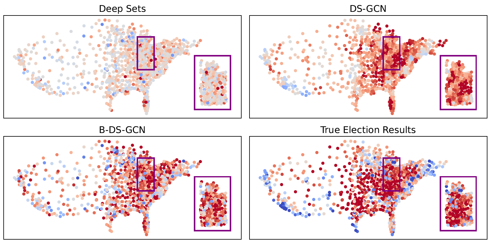

# Bag-Graph-MIL

## Bag Graph: Multiple Instance Learning using Bayesian Graph Neural Networks

This repository contains the code to replicate the results reported in our AAAI 2022 submission: *Bag Graph:
Multiple Instance Learning using Bayesian Graph Neural Networks*. 

When the datasets are small enough we include them in the repository, otherwise we point to the original source where they can be downloaded. We provide all pre-processing code and the plotting code for the diagrams in the paper.

## Getting Started

Install the dependencies from the command line with `pip`:

```sh
pip install -r requirements.txt --progress-bar off
```

## Training
All our experiments occupy separate folders. To run a specific experiment go to the appropriate directory and follow the instructions below. Unless otherwise specified, the datasets are included in the experiment subfolders.
### Running Experiments & Reproducing Results
We perform classification experiments on 5 benchmark MIL datasets, 20 text datasets from the 20 Newsgroups corpus,
and the 2016 US election data. In addition, we also consider a distribution regression task of predicting neighborhood
property rental prices in New York City.
#### 1. Benchmark MIL Datasets
Go to `mil_benchamark` folder and run:
```sh
python run_trials.py
```
#### 2. Text Categorization
Navigate to `mil_text` folder and run:
```sh
python run_trials.py
```
#### 3. Electoral Results Prediction
To get the data go to [the source repository](https://github.com/flaxter/us2016/tree/master/data) and download `centroids_cartesian_10.csv` and `results-2016-election.csv`. Create a `data` subdirectory and copy these files there.
Continue by downloading the `set_features` and `cleaned_set_features` subdirectories from our [drive link](https://drive.google.com/drive/folders/1Qb5us6pu0RUGD20UaFKPy1I8OdPmKDrQ?usp=sharing) and saving them under the same `data` directory.

In `mil_election_classification` folder run:
```sh
python run_trials.py
```
After the runs have completed you can get the figure from the paper by running:
```sh
python visualization.py
```
You should get the following figure (top 2 methods are baselines, bottom left is ours, bottom right is ground truth):



#### 4. Rental Price Prediction
Locate `mil_benchamark` folder and run:
```sh
python deepset_main.py              # runs DeepSet backbone trials
python set_transformer_main.py      # runs Set Transformer backbone trials
python evaluate.py                  # statistical significance tests
```

